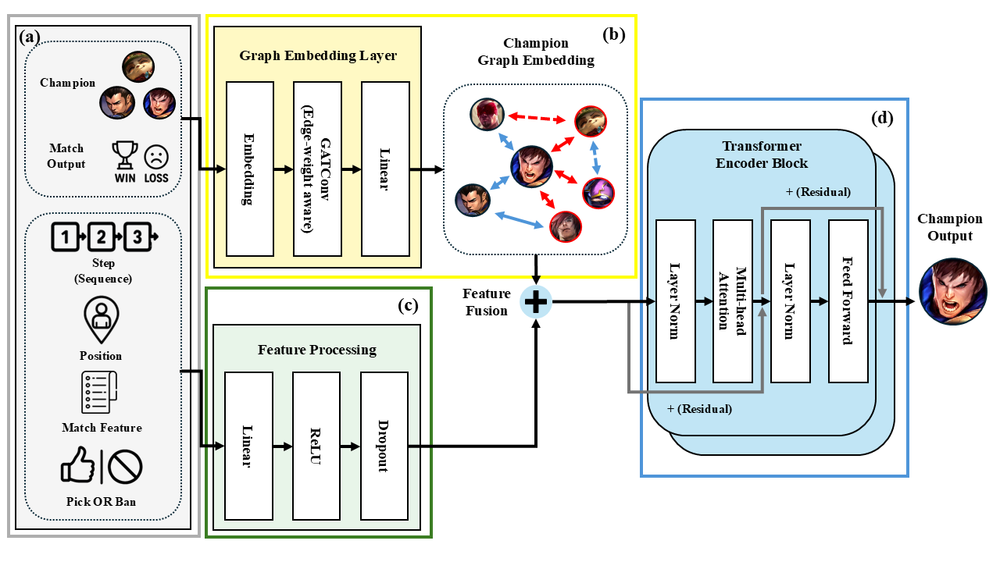

# GARENRec: Graph-Attention based Transformer Network for League of Legends Draft Recommendation

We present GARENRec, a graph-enhanced Transformer model designed to support strategic decision-making in multi-item recommendation tasks. By incorporating both relational signals through Graph Attention Networks and sequential patterns via Transformer layers, GARENRec effectively models the complex dynamics of team-based environments. This dual-structured approach enables the model to better capture synergy, counter-strategy, and temporal flow in decision sequences. For further details on methodology and experimental results, please refer to the paper.

Overall architecture of GARENRec. The architecture consists of (a) an input processing section with various features, (b) Graph Embedding Layer for processing relationship information, (c) Feature Embedding Layer that handles feature representation, and (d) a Transformer Encoder Block that generates the final Champion Output. The model applies masking to respect already selected champions, ensuring adherence to game rules.

<p align="center"></p>

## Project Structure

```
GARENRec/
├── config/
│   └── config.yaml         # Configuration settings
├── data/
│   ├── champion_relationships.py # Champion relationship analysis
│   ├── dataset.py          # Dataset classes and data processing
│   └── match_data_processor.py # Match data preprocessing
├── models/
│   ├── garen_rec.py        # Main GARENRec model
│   └── layers.py           # Model layers (GraphEmbedding, Loss, etc.)
├── utils/
│   ├── metrics.py          # Evaluation metrics (HR@k, NDCG@k) and loss functions
│   └── utils.py            # Utility functions (data loading, model saving, etc.)
├── run_hyper.py            # Hyperparameter tuning script
├── main.py                 # Main execution script
└── requirements.txt        # Dependencies
```

## Requirements

```
torch==2.1.0
torchvision
pandas
tqdm
optuna
torch-scatter
torch-sparse
torch-cluster
torch-spline-conv
torch-geometric
numpy
pyyaml
scikit-learn
matplotlib
```

## Installation

Install dependencies:

```bash
pip install -r requirements.txt
```

## Usage

Run main:

```bash
python main.py --config config/config.yaml
```

## Datasets

The model uses two main datasets:
1. **Draft Data**: Champion picks and bans with positions
2. **Match Data**: Player performance metrics

Required columns in draft data:
- `gameid`: Unique identifier for each match
- `BB1-BB5`, `RB1-RB5`: Blue and Red team bans
- `BP1-BP5`, `RP1-RP5`: Blue and Red team picks
- `BR1-BR5`, `RR1-RR5`: Blue and Red team roles/positions
- `Winner`: 1 if Blue team won, 0 if Red team won

Required columns in match data:
- `gameid`: Unique identifier for each match
- Performance metrics (kills, deaths, assists, etc.)
- `side`: Team side (Blue/Red)

## Disclaimer

This project uses League of Legends data in compliance with the [Riot Games Developer Portal Policy](https://developer.riotgames.com/policies/general). All data is collected and used solely for academic research purposes, not for commercial activities. League of Legends and all related assets are intellectual property of Riot Games, Inc.

Part of the pick-ban sequence data comes from the League of Legends Esports Wiki on Fandom, which is licensed under the [Creative Commons Attribution-ShareAlike 3.0 License](https://www.fandom.com/licensing).